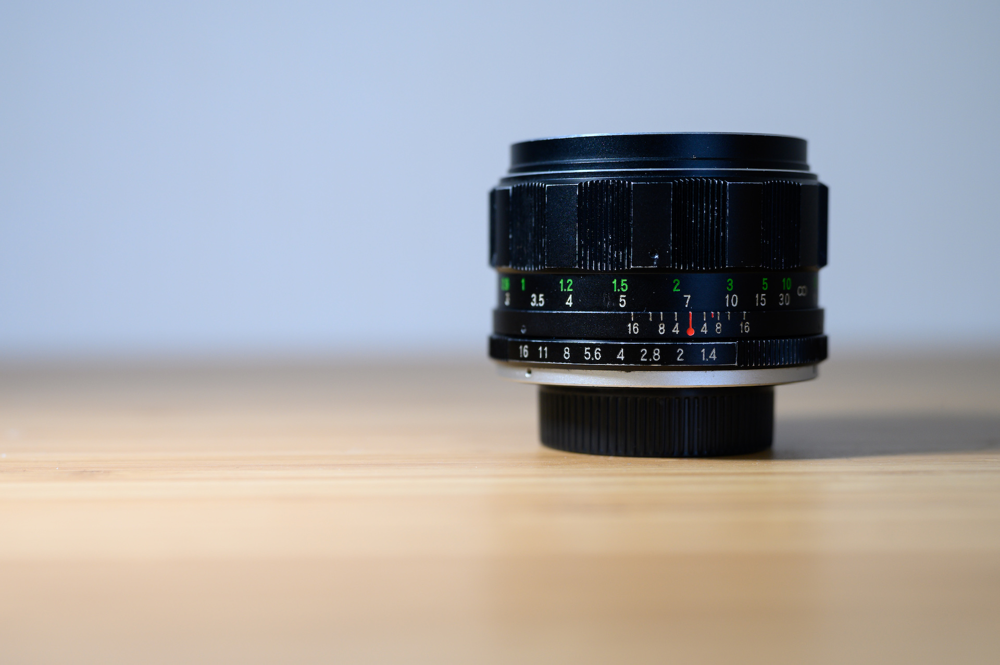
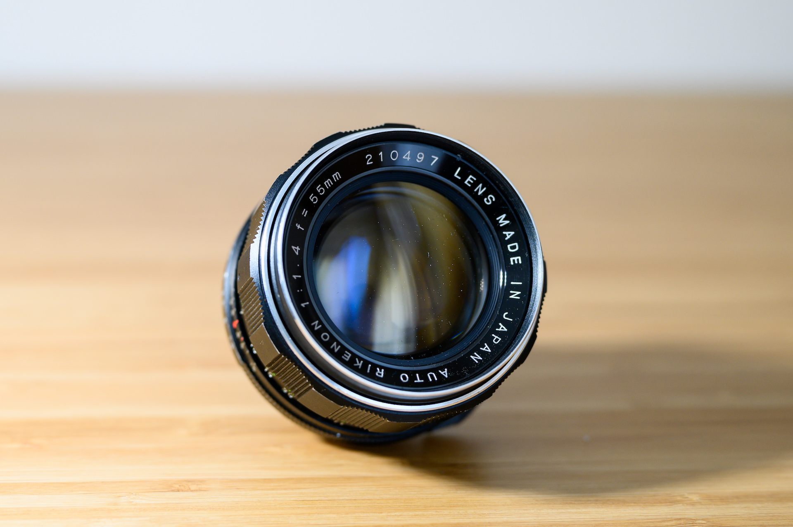
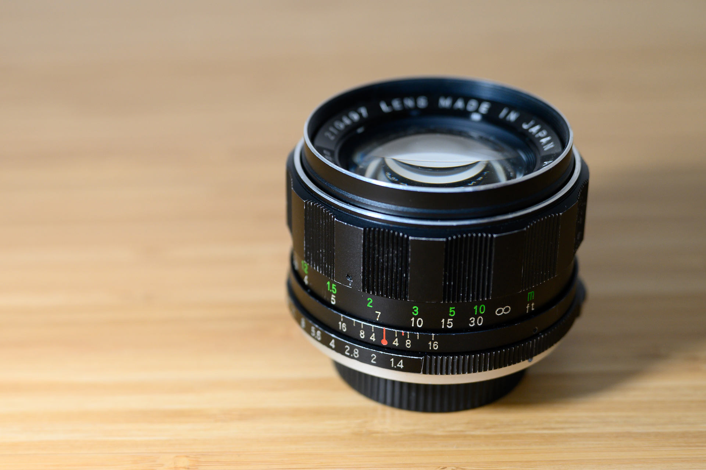
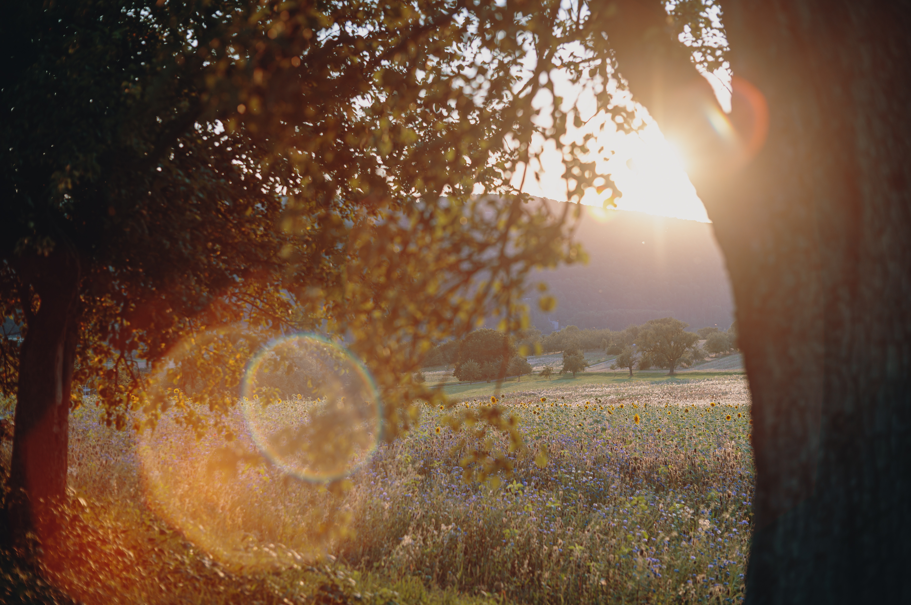
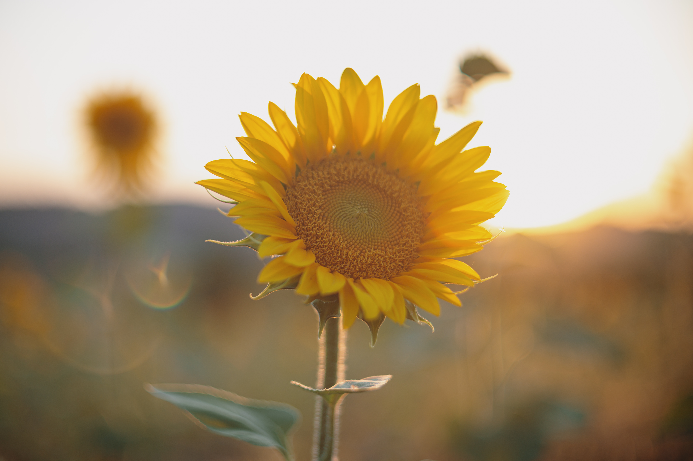
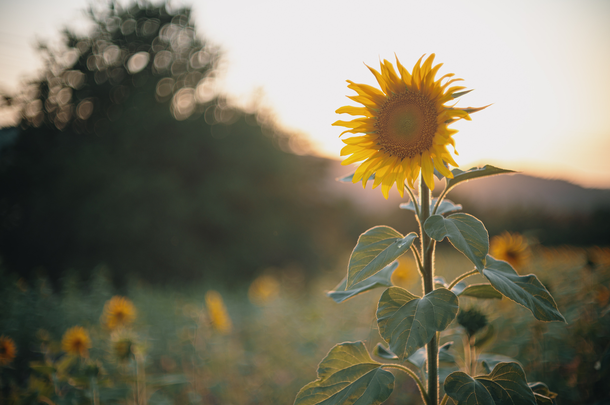

## The Lens
Compared to my last vintage lens, this one is a little bigger and has some more heft to it. I think that is mainly related to the faster aperture of f1.4. The built quality is pretty nice and the current conditions of the lens are great. There aren’t any big scratches. The glass seems to be clear and the focus ring, as well as the aperture ring, are running smoothly.

## The Adapter
As this is a M42 mount lens as well, I can use the same K&F Adapter (M42 Lenses to Nikon Z Mount) as with my last vintage lens. If you would like to get some more information, check out my last vintage lens article. Again this adapter is adding some size to the whole setup. Mounted to the Z6 looks way more natural than the last lens due to the bigger diameter. Again I really like how the whole setup looks.

## Sample Images

Since I enjoyed how the sunflower images turned out the last time, I again took a little walk around sunset. I wanted to see how the bokeh and the lens flares are looking.

I started with some closed aperture landscape images to see the overall performance with a slow aperture.

Even with the aperture closed, I already appreciated how the lens flares are looking. So it was time to take it to the next level and open the aperture. That’s why I bought a f1.4 lens anyways.

Please get ready for those bokehlicious sunflower shots!

## Summary
I must admit, that I am really impressed by this lens. I really enjoyed using the Auto Revuenon 50mm f1.9 but in my opinion, this lens is in another league. The bokeh and the lens flares are looking amazing and the center is surprisingly sharp even at 1.4.

I am really looking forward to experiment and play around with this lens in the future. Stay tuned!

And last but not least, some more sunflower images shot with this lens.